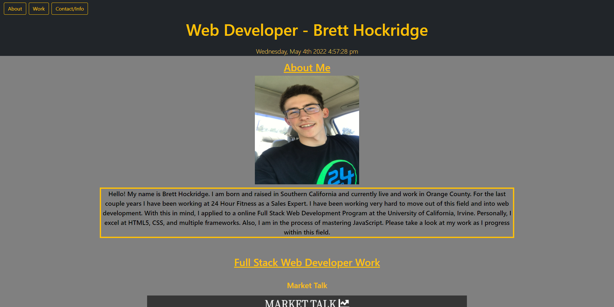
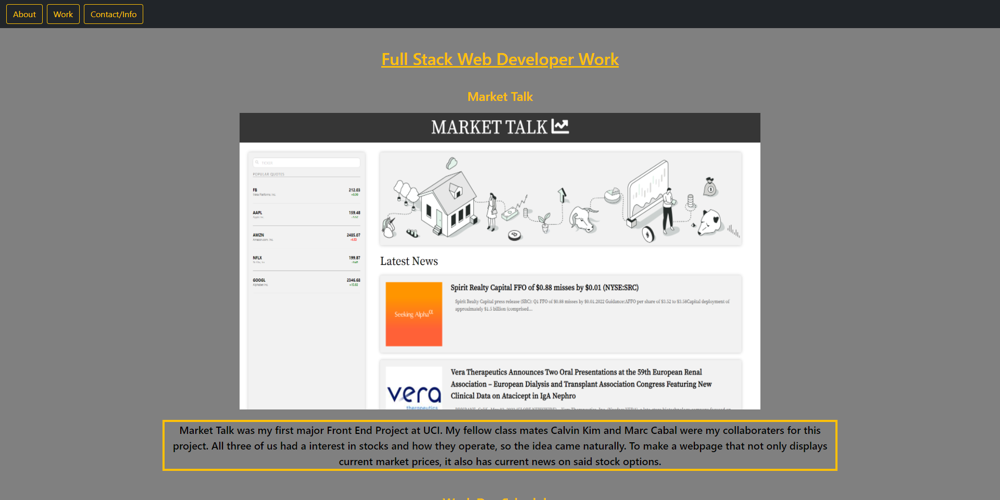
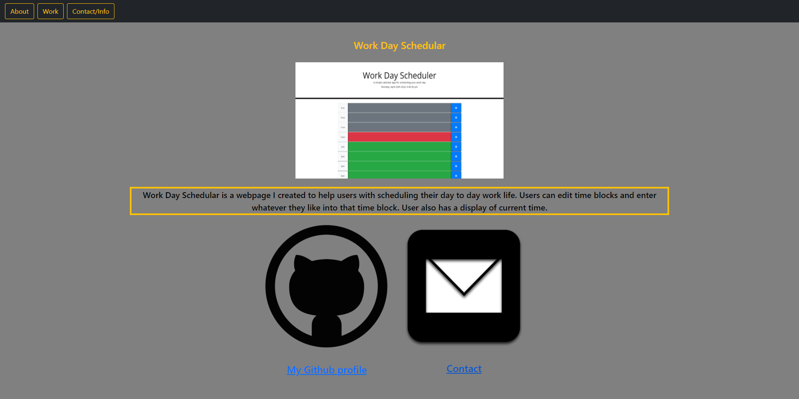

# updated-portfolio

# Homework 8: Updated Portfolio

 

## Description:

Updated professional portfolio to have Project 1 and best homework assignment. Portfolio also has my personal github link and a contact me link.

 

## Table of Contents:

- Installation
- Screenshots
- Credits
- License
- Contribute
- Github URL
- Webpage URL

 

## Installation

Go to <a href="https://brobrett.github.io/updated-portfolio/" alt="Brett's updated portfolio webpage">Brett's Updated Portfolio</a> to view webpage.

 

## Screenshots

[Screenshot1] Top of webpage featuring navbar, header, and about me.

 

[Screenshot2] Project 1 Market Talk with description of webpage.

 

[Screemshot3] Work Day Schedular webpage and contact links for Github and email contact.

 

## Credits

- Thank you to BCS and my instrcutors for helping me in office hours

 

## License

- MIT License - copyright (c) Brett Hockridge

 

## How to Contribute

Feel free to email me via email link on webpage to ask to contribute

 

## Github URL

Click <a href="https://github.com/BroBrett/updated-portfolio" alt="Brett's updated portfolio github link">here</a> to view Updated Portfolio github link.

 

## Webpage URL

Click <a href="https://brobrett.github.io/updated-portfolio/" alt="Brett's updated portfolio webpage">here</a> to view Updated Portfolio webpage.